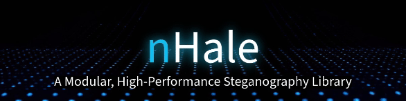

<div align="center">
  
</div>

<div align="center">
  
  <!-- CI temporarily disabled during development -->
  <!-- [](https://github.com/iron-hope-shop/nHale/actions/workflows/ci.yml) -->
  [](https://github.com/iron-hope-shop/nHale/releases)
  [](https://opensource.org/licenses/MIT)
  
</div>

---

<div align="center">
  <h2>📖 Contents</h2>
</div>

<details open="open">
<summary><strong>Getting Started</strong></summary>

- [Introduction](#1-introduction)
  - [Overview](#11-overview)
  - [Objectives](#12-objectives)
- [Quick Start](#3-quick-start)
  - [Installation](#installation)
  - [Basic Usage](#basic-usage)

</details>

<details open="open">
<summary><strong>Core Documentation</strong></summary>

- [System Architecture](#2-system-architecture)
  - [High-Level Design](#21-high-level-design)
  - [Supported File Formats](#22-supported-file-formats)
  - [Core Modules](#23-core-modules)
- [Development](#4-development)
  - [Prerequisites](#prerequisites)
  - [Testing](#testing)
  - [Contributing](#contributing)

</details>

<details open="open">
<summary><strong>Project Information</strong></summary>

- [Project Status](#6-project-status)
  - [Implemented Features](#implemented-features)
  - [Planned Features](#in-progress--planned-features)
- [Code Structure](#7-current-code-structure)
- [License](#5-license)

</details>

---

## **1. Introduction**
### **1.1 Overview**
nHale is an open-source advanced steganography toolkit designed for secure message embedding, extraction, and analysis across various file formats. It is a Rust-first project, providing a lightweight, efficient, and modular implementation of steganographic algorithms. This tool is aimed at cybersecurity professionals, privacy advocates, and digital forensics experts.

### **1.2 Objectives**
- Develop a high-performance, lightweight Rust-based steganography library.
- Provide native embedding and extraction capabilities for multiple file types.
- Implement strong encryption before embedding data for enhanced security.
- Ensure robust metadata and watermarking functionalities.
- Maintain strict software development best practices.

---

## **2. System Architecture**
### **2.1 High-Level Design**
- **Core Engine:** Rust-based steganography algorithms.
- **CLI Interface:** Rust-based command-line interface with comprehensive options.

### **2.2 Supported File Formats**

#### Currently Implemented
- **Images:** PNG (fully implemented), JPG (partially implemented)
- **Documents:** PDF (fully implemented)

#### Planned for Future Implementation
- **Images:** BMP, GIF
- **Audio:** WAV, MP3
- **Video:** MP4

### **2.3 Core Modules**

#### Currently Implemented
- **Embedding Module:** Hides encrypted data inside PNG, JPG, and PDF files.
- **Extraction Module:** Recovers hidden messages from PNG, JPG, and PDF files.
- **Integrity Checker Module:** Ensures hidden data has not been modified (implemented for PDF).
- **Encryption Module:** AES-256, ChaCha20, and RSA encryption support.
- **Error Correction Module:** Reed-Solomon error correction for JPG steganography.

#### Planned for Future Implementation
- **Watermarking Module:** Embeds and verifies digital watermarks.
- **Enhanced Metadata Module:** Advanced metadata manipulation for various file formats.
- **PDF Analysis Module:** Detects hidden scripts and anomalies.

---

## **3. Quick Start**

### **Installation**

#### From Source
```bash
# Clone the repository
git clone https://github.com/iron-hope-shop/nHale.git
cd nhale

# Build the project
cargo build --release

# Run the CLI
./target/release/nhale-cli --help
```

### **Basic Usage**

#### Embedding data in a PNG image
```bash
nhale-cli embed -i input.png -o output.png -d "Secret message"
```

#### Extracting data from a PNG image
```bash
nhale-cli extract -i output.png
```

#### Using encryption
```bash
nhale-cli embed -i input.png -o output.png -d "Secret message" -p "your-secure-password" -a aes256
```

#### Embedding data in a PDF
```bash
nhale-cli embed -i input.pdf -o output.pdf -d "Secret message"
```

#### Extracting data from a PDF
```bash
nhale-cli extract -i output.pdf
```

---

## **4. Development**

### **Prerequisites**
- Rust 1.67.0 or higher
- Cargo

### **Testing**
```bash
cargo test
```

### **Contributing**
Please read [CONTRIBUTING.md](CONTRIBUTING.md) for details on our code of conduct and the process for submitting pull requests.

---

## **5. License**
This project is licensed under the MIT License - see the [LICENSE](LICENSE) file for details.

---

## **6. Project Status**

### **Implemented Features**
- [x] Rust-based LSB embedding and extraction for PNG images.
- [x] JPG steganography with DCT coefficient modification (partially implemented).
- [x] PDF embedding and extraction with integrity checking.
- [x] AES-256, ChaCha20, and RSA encryption modules.
- [x] Integrity checking and HMAC verification for PDF files.
- [x] Reed-Solomon error correction (needs better integration with JPEG).
- [x] Basic CLI commands and argument parsing.
- [x] Advanced configuration options for steganography techniques.

### **In Progress / Planned Features**
- [ ] Improved JPEG steganography with better error correction integration.
- [ ] Complete metadata manipulation utilities.
- [ ] BMP and GIF image processing.
- [ ] Audio processing utilities (WAV, MP3).
- [ ] Video processing utilities (MP4).
- [ ] Watermarking functionality (visible and invisible).
- [ ] Batch processing capabilities.
- [ ] Enhanced CLI documentation and help.
- [ ] Performance optimization and security auditing.
- [ ] End-to-end integration tests.
- [ ] Packaging and release for various platforms.

---

## **7. Current Code Structure**
```plaintext
nHale/
├── Cargo.toml             # Project dependencies and configuration
├── Cargo.lock             # Locked dependencies
├── LICENSE                # MIT license
├── CHANGELOG.md           # Version history
├── CONTRIBUTING.md        # Contribution guidelines
├── README.md             # Project documentation
├── images/
│   └── banner.gif        # Project banner image
├── docs/
│   ├── jpeg_steganography.md    # JPEG steganography documentation
│   ├── error_correction.md      # Error correction documentation
│   └── steganography.md         # General steganography documentation
└── src/
    ├── lib.rs            # Core library functionality
    ├── embedding.rs      # Embedding module for PNG, JPG, PDF
    ├── extraction.rs     # Extraction module for PNG, JPG, PDF
    ├── encryption.rs     # Encryption (AES, ChaCha20, RSA)
    ├── error_correction.rs # Error correction for lossy formats
    ├── integrity.rs      # Integrity checking with HMAC
    ├── metadata.rs       # Basic metadata handling
    ├── pdf.rs           # PDF steganography
    ├── utils.rs         # Helper functions and utilities
    ├── watermarking.rs  # Watermarking module
    └── bin/
        ├── cli.rs       # CLI implementation
        └── create_test_pdf.rs # Utility for creating test PDFs
```

### **See Also**
- [CHANGELOG.md](CHANGELOG.md) for version history.
